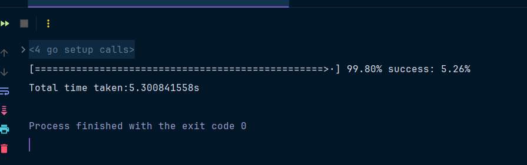

data.csv 中有一列发布链接，你需要检查该链接是否正常（可以访问），把异常的链接所在的行去除。最终形成两个文件： 正常的文件good.csv, 异常的文件bad.csv。

用户要求：

生成一个可执行性文件给他，他需要定期运行。
执行时间越短越好，不能过长，不然不结尾款。(要求小于 5min)
执行过程要打印执行的进度。
提交格式:

新建一个仓库，用于本项目。（建仓库又不要钱，哈哈 ^^）
将处理后的两个文件，和可执行文件一起提交
在 README.md 里写上程序耗时。
在本仓库新建一个 issue,并附上你的仓库的地址。

### 程序耗时：

