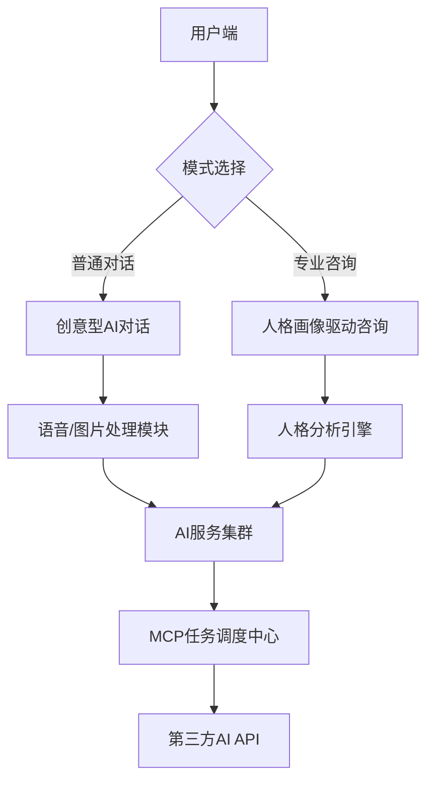

# 心理咨询对话系统开发文档（AI + MCP 实现）

---

## 一、系统架构设计

## 二、技术选型建议
模块	技术方案	说明
前端框架	Vue3 + Vuetify	支持语音录制、图片上传组件
后端框架	Gin (Go)	高性能API服务，支持协程并发
AI服务接入	DeepSeek API	统一接口处理文本生成/图像生成（预算友好型方案）
语音处理	Web Speech API	浏览器原生API，零成本集成（需HTTPS环境）
图像生成	DeepSeek-Vision	与对话API同一平台，减少接入成本
任务调度	Redis Streams	轻量级消息队列，Go语言原生支持
数据存储	SQLite + JSON	本地轻量化存储（适合中等性能笔记本开发环境）
三、核心模块设计
1. 普通对话模式
(1) 创意对话实现
python
# DeepSeek 提示词模板（预算优化版）
PROMPT_TEMPLATE = """
[角色设定]
你是一位擅长用创意方式疏导情绪的心理咨询师，请根据以下要素生成回应：
1. 必须使用比喻或故事形式
2. 每次提供2种不同风格的选项
3. 响应长度控制在100字以内

[对话上下文]
用户输入：{user_input}
历史摘要：{summary}（最近3轮对话的关键词提取）

[响应示例]
诗意风格："你的感受像山谷中的晨雾，看似朦胧却孕育着..."
幽默风格："这让我想起那只追着自己尾巴的猫，其实答案就在..."
"""
(2) 多媒体处理流
Diagram
Code
2. 专业心理咨询模式
(1) 人格画像构建
轻量化数据采集方案：

markdown
1. **交互式问卷**：5分钟快速MBTI测试（10道精选题目）
2. **文字分析**：基于TF-IDF的关键词提取（本地计算）
3. **行为建模**：响应间隔/问题类型偏好（滑动窗口统计）
(2) 咨询流程引擎
go
type StrategySelector struct {
    // 本地缓存人格策略配置
    Strategies map[string]ConsultStrategy `json:"strategies"`
}

func (s *StrategySelector) LoadStrategies() {
    // 从JSON文件加载预设策略（避免数据库依赖）
    strategies := map[string]ConsultStrategy{
        "A型人格": {PhaseOrder: [...]}, 
        "回避型":  {PhaseOrder: [...]},
    }
}
(3) 危机干预模板
markdown
[危机处理协议]
1. 触发条件：检测到自伤类关键词（刀/死/药等）
2. 响应流程：
   - 即时发送稳定话术："我感受到你现在很难过，我们先做个深呼吸好吗？"
   - 启动本地应急脚本（弹出危机热线浮层）
   - 记录对话摘要（自动生成PDF报告）
四、MCP集成方案
1. 轻量级任务调度
go
// 基于Redis Streams的任务处理器
func StartTaskConsumer() {
    for {
        // 动态优先级获取
        tasks := redis.XRead(streams: map[string]int{
            "emergency": 0, 
            "normal":    1,
        })
        
        for _, task := range tasks {
            go ProcessTask(task)
        }
    }
}
2. 资源优化策略
markdown
1. **模型选择**：优先调用DeepSeek的`light`版API
2. **缓存机制**：高频问题响应本地缓存（TTL: 24h）
3. **降级方案**：
   - 图片生成失败 → 返回预设插画
   - API超时（>3s） → 触发本地话术库
五、设备适配方案
1. DeepSeek API vs 本地部署对比
维度	API方案	本地部署
硬件需求	无特殊要求	需要GPU（至少6GB显存）
响应速度	依赖网络延迟（平均200-500ms）	需要优化模型推理速度
隐私性	数据经过第三方	完全本地处理
成本	$0.1/千token（开发阶段可控）	需购置推理加速硬件
2. 推荐方案
markdown
1. **开发阶段**：全API方案（成本可控，快速迭代）
2. **试点运行**：混合方案（关键模块本地化）
3. **生产环境**：按需采购云GPU（避免固定资产投入）
六、部署拓扑（开发环境）
yaml
# docker-compose.yml 精简版
services:
  web:
    build: ./frontend
    ports: ["80:80"]
    
  api:
    build: ./backend
    environment:
      DEEPSEEK_KEY: ${API_KEY}
      
  redis:
    image: redis:alpine
七、监控指标
指标类型	监控方式	预警阈值
API成功率	Prometheus计数器	<95% (持续5分钟)
响应延迟	Grafana趋势图	P99 > 800ms
资源占用	本地任务管理器	内存 > 70%
会话完整性	自定义事件日志	异常中断率 > 10%
设备适配建议：优先使用API方案避免本地计算压力，通过代码级优化（如请求批处理、响应缓存）降低token消耗。开发环境建议使用SQLite+Redis组合，避免MySQL资源占用。